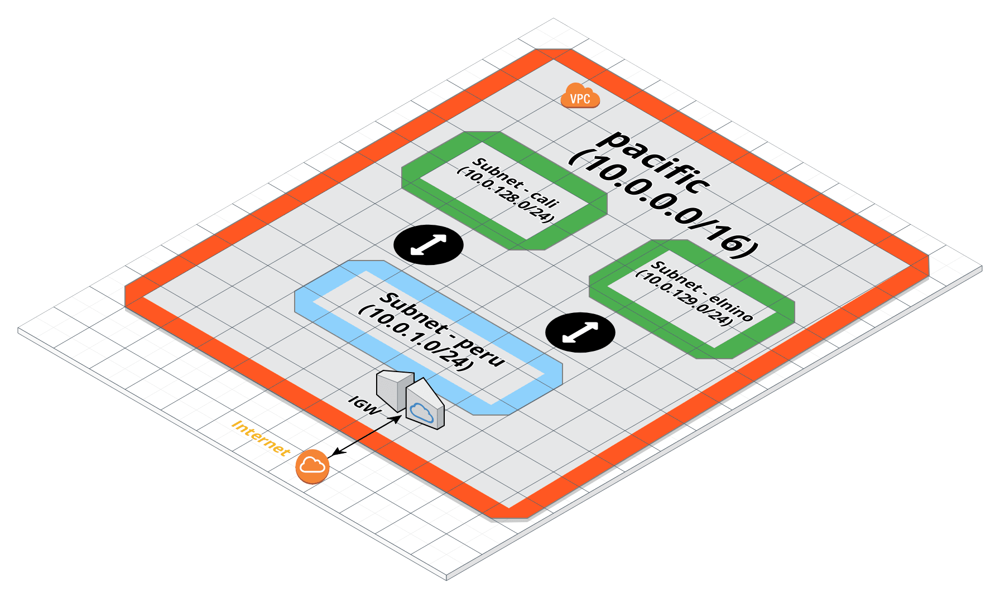

# prov_aws_vpc_terraform

Provision Amazon Web Services VPC using Terraform modules

The example here provides [Terraform](https://www.terraform.io/) scripts to
provision a VPC, 2 private subnets, 1 public subnet, 1 private security group
and 1 public security group. The layout of this looks like following:



## Why Modules?

[Modules](https://www.terraform.io/docs/modules/index.html) make it easier to
break down the scripts into reusable pieces. These pieces can then be used to
compose infrastructure components as per requirements. Since modules are
dependent on each other by exported variables, the module implementation can
change anytime without affecting any dependent components.

The scripts in this project have been broken down into four modules
- vpc:
    - input: vpc info from variables
    - output: vpc id
- private subnet:
    - input: vpc id from vpc module
    - output: subnet id
- public subnet:
    - input: vpc id from vpc module
    - output: subnet id
- security group
    - input: private and public subnet id's from respective modules
    - output: private and public security group id's

## Executing the scripts

- Install terraform (we're using version v0.11.8)
- Clone the repo
- Run `terraform init` to initialize the modules and provider
- Export AWS account keys

```
$ export AWS_ACCESS_KEY_ID=myawsaccesskeyid
$ export AWS_SECRET_ACCESS_KEY=myawsecretaccesskey
```
- Run `terraform plan` to dry-run the scripts
- If everything looks good, run `terraform apply`
- If you need to change any values, it's recommended to override the variables
  in environment rather than changing the code e.g. if you need to change the
  name of vpc, which is defined as `vpc_name` in `variables.tf` file, do the following

```
$ export TF_VAR_vpc_name=my_vpc_name
$ terraform plan
$ terraform apply
... output
```

## Next Steps

- We're going to use the state file generated from the execution of these
  scripts as an input to the next stage of provisioning the infrastructure.

